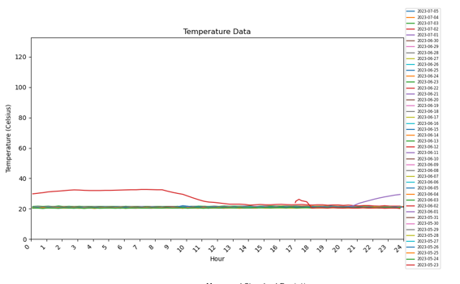

# Data Report Template

This file should be created for each dataset received or processed for the project. Please copy and rename the data report inline with the [data overview document](/docs/2.DataAcquisitionAndPreparation/Data%20Pipeline/DataOverview.md). Update the links in the data definition document from this template to the copied and completed files. 

## Summary statistics of the data for one flight simulator ()

The dataset is gathered from a Boeing simulators such as 737 MAX aircraft,  The general breakdown of the dataset is as follows:

1. DataMessageGUID: A unique identifier for each message or data point.
2. SensorID: Identifies the specific sensor, in this case, consistently recorded as 683664.
3. Sensor Name: Describes the sensor, here it is labeled B737MAX-8-M-03, likely indicating the aircraft model and sensor type.
4. Date: The timestamp for when the data was recorded (in MM/DD/YYYY HH:MM format).
5. Value: Indicates the main measured value, possibly referring to an electrical parameter (e.g., current or temparture or light ).
6. Formatted Value: A text description of the value, including additional details like min/max values and averages for each phase of electrical measurements (e.g., Ah ratings, phase duty cycles).
7. Battery: Appears to be a constant value of 100, likely indicating the battery's health or charge level.
8. Raw Data: Contains detailed measurements for Phase 1, Phase 2, and Phase 3, such as their average, minimum, and maximum values.
9. Sensor State: Binary field (0 or 1), indicating whether the sensor is inactive (0) or active (1).
10. GatewayID: Identifies the gateway through which the sensor data is transmitted, in this case consistently 965435.
11. Alert Sent: Boolean (True/False) indicating whether an alert was triggered based on the sensor's data.
12. Signal Strength: Indicates the signal strength of the sensor's transmission (measured in some arbitrary units).
13. Voltage: The recorded voltage from the sensor, with a mean of around 3.31 volts.
14.Additionally, the dataset contains information about Phase 1, Phase 2, and Phase 3 electrical measurements, which were extracted from the Raw Data field. Each phase has average, minimum, and maximum values, indicating usage or performance across different phases.

The Statistical vaules for one of the dataset B737MAX-8-M-03 is as follows: 

1. Value:
    * Mean: 6.54
   *  Minimum: 0.00
    * Maximum: 62.60

2. The average values for the three phases across all records are as follows:

    * Phase 1 Average: 14.87
    * Phase 2 Average: 13.41
    * Phase 3 Average: 11.07

## Initial plots of the data

Some Plots for Boeing Simulator (737MAX-8-M-03), Temperature and Light Sensors are as follows: 

1. Daily Hourly Average (RMS Current): 

2. Heatmap Phase 1, 2 and 3 MAX values. 

  * Phase 1 Max 
  
  * Phase 2 Max 
  
  * Phase 3 max 
  

  3. Hourly Current Consumption Heatmap 
 

 4. Light Chart 

 5. Temperature chart 

## Data quality summary
 
Use the 3 data quality metrics from ISO8000-8. 
1.  is the data accessible by those who need it?  Yes
2. Does the data read correctly into the relevant tools and maintain it's meaning?  Yes 
3. Does the data represent what it is supposed to?  Yes

## What is(are) the target variable(s)? 

This project deos not relate to any target variables. 
## What are the explanatory variables? 
N/A
## Do you need to screen the variables? If yes, detail it here. 
i.e. use some technique to choose a priority list for investigation?
N/A
## What can be seen from the summary statstics and figures? 
This will also help with interpretation after modelling? 

The data does not provide any accurate evidence of patterns but can be very useful to know the total consumption of each simulators and provide an understanding of total requirement of current from sustainable sources like solar or wind turbines to acheive net zero target. 
## Is further processing required? If yes, detail.

No, Not required 
## Is modelling required? If yes, can any of the exploratory information be helpful? 

N/A

 *Page created by LL - Feb 2024*