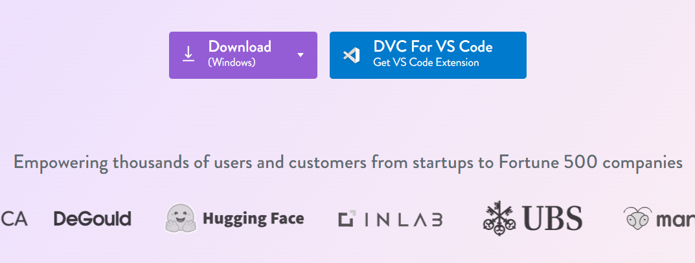

# DVC (Data Version Control)

The guidance provided in this page is taken from the [DVC documentation](https://dvc.org/doc/start), and edited to match the utilities provided in this template. The guidance here is intended to get you set up and running with minimal effort and prior knowledge, so make sure to go through the documentation and other resources available online to improve your capabilities once you feel comfortable with the basics.

How cool would it be to track large datasets and machine learning models alongside your code, sidestepping all the limitations of storing it in Git? Imagine cloning a repository and immediately seeing your datasets, checkpoints and models staged in your workspace. Imagine switching to a different version of a 100Gb file in less than a second with a git checkout.

💫 DVC is your "Git for data"!

DVC only commits a tiny metadata file to git instead of the actual data files. The guidance below assumes that you are managing and keeping your data/models locally within the project directory, if you require remote storage (for e.g., through a cloud provider such as Azure, or on the K: Drive) see the [remote storage documentation](https://dvc.org/doc/user-guide/data-management/remote-storage) on the DVC web page.

## Installation

Install DVC via the download button on the [DVC homepage](dvc.org) (near the bottom):



You will only need to do this once and DVC should be available for all your projects. Note that you will need to re-download the installer if you wish to update DVC in the future, and if you wish to use the [Python API](https://dvc.org/doc/api-reference) you can install that in your virtual environment using pip or conda.

<!-- Ensure you have set up your virtual environment as described in the [Getting Started](./GettingStarted.md) guidance page. You should have also included `- dvc` in the [`environment.yml`](/code/environment.yml) file, which is included by default. -->

<!-- The DVC documentation provides guidance on [installing manually](https://dvc.org/doc/install), but it is recommended to follow the standardised approach using conda + package management in the [`environment.yml`](/code/environment.yml) file. -->

<!-- ## Installation on Windows

To use DVC as a [Python library](https://dvc.org/doc/api-reference), you can install it with conda or with pip (below). -->

See [Running DVC on Windows](https://dvc.org/doc/user-guide/how-to/run-dvc-on-windows) for important tips to improve your experience on Windows.
<!-- 
### Install with conda

Requires Miniconda or Anaconda Distribution.

You can use conda from [Anaconda Prompt](https://docs.anaconda.com/free/anaconda/getting-started/), a POSIX-like command line terminal in Windows.

    conda install -c conda-forge mamba # installs much faster than conda
    mamba install -c conda-forge dvc

### Install with pip

We strongly recommend creating a virtual environment or using pipx to encapsulate your local environment.

Note that Python 3.8+ is needed to get the latest version of DVC.

    pip install dvc

### Windows installer

A quick way is to use the self-contained, executable installer (binary), which is available from the big "Download" button on the [home page](https://dvc.org/).

You'll need to download and run the installer again each time you want to update DVC. You may use Windows Uninstaller to remove the program.

Note that this method by default enables symlink permissions for all users, so they can use them to optimize DVC operations. -->

## Initialising a project

Inside your chosen directory, we will use our current working directory as a DVC project. Let's initialize it by running dvc init inside a Git project:

    dvc init
A few internal files are created that should be added to Git:

    $ git status
    Changes to be committed:
            new file:   .dvc/.gitignore
            new file:   .dvc/config
           ...
    $ git commit -m "Initialize DVC"

Now you're ready to DVC!

## Tracking data

Working inside an initialized project directory, let's pick a piece of data to work with. We'll use an `example_data.csv` file, though any text or binary file (or directory) will do. Use `dvc add` to start tracking the dataset file:

```
dvc add data/external/example_data.csv
```

DVC stores information about the added file in a special `.dvc` file named `data/external/example_data.csv.dvc`. This small, human-readable metadata file acts as a placeholder for the original data for the purpose of Git tracking. 

## Storing and sharing

You can upload DVC-tracked data to a variety of storage systems (remote or local) referred to as [remotes](https://dvc.org/doc/user-guide/data-management/remote-storage).

Configure a directory to act as your storage remote using the following command:

```
dvc remote add -d [name] [path]
```

For example, lets say we want to create a remote called `data-science-template` and have it hosted on the ``K:Drive``, run:

```
dvc remote add -d data-science-template K:/Data-Science/Template

>> Setting 'data-science-template' as a default remote.
```

### Uploading data

We can now upload data to the storage remote with [`dvc push`](https://dvc.org/doc/command-reference/push):

```
dvc push
```

### Retreiving data

Once DVC-tracked data and models are stored remotely, they can be downloaded with [`dvc pull`](https://dvc.org/doc/command-reference/pull) when needed (e.g. in other copies of this project). Usually, we run it after `git pull` or `git clone`.

```
dvc pull
```

**This guidance document is WIP, refer to the [official DVC documentation](https://dvc.org/doc/use-cases/) for further tutorials on the use of DVC** 
