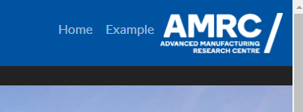

# Dashboarding

Dashboards (or web apps) can be a really powerful way to showcase the value of your project to the customer, when compared to a more traditional deliverable like a powerpoint presentation, particularly if it can be deployed in real-time alongside your physical demonstrator.

Popular frameworks for building dashboards include [Plotly Dash](https://dash.plotly.com/), [R Shiny](https://www.rstudio.com/products/shiny/) ([Shiny for Python](https://shiny.posit.co/py/docs/overview.html) is also now available), [Microsoft Power BI](https://www.microsoft.com/en-us/power-platform/products/power-bi) or [MATLAB Web App Server](https://uk.mathworks.com/products/matlab-web-app-server.html).

The project template is provided with a skeleton application for building interactive dashboards in Python with [Plotly Dash](https://dash.plotly.com/). The aim of this is to provide you with a solid foundation of boilerplate with a reasonable level of complexity/functionality to get your web app up and running quickly. With this, we are also able to provide a standardised structure and presentation with appropriate AMRC branding, reducing variability between projects and making the process easier for our researchers.

We strongly encourage feedback on the Python template and welcome collaboration on developing appropriate versions for frameworks in other languages, such as R or MATLAB.

## Running the dashboard with docker

The primary method for running the application is via the [`docker-compose.yml`](/docker-compose.yml) file. Ensure that the following section is not commented (i.e. there are no # before any of the lines highlighted below):

```
  dashboard:
    restart: unless-stopped
    build:
      context: ./code/dashboard
    ports:
        - "8050:8050"
    volumes:
      - ./code/dashboard:/app
      - ./data:/data
    env_file:
      - ./code/environment_variables/dashboard.env
```

and run in the terminal:

```
docker compose build
```

followed by:

```
docker compose up 
```

Also recall from the [Docker Guidance](/docs/Guidance/Docker.md) page that you can run it in the background with:

```
docker compose up -d
```

## Accessing the dashboard

The dashboard should now be accessible in the browser on [localhost:8050](http://localhost:8050/):


The first page to open is the main page, the content and layout of which is defined in [index.py](/code/dashboard/index.py). Two buttons on the Navbar (defined in [navbar.py](/code/dashboard/navbar.py)) are included by default (top right), linking to pages [Home](localhost:8050) and [Example](localhost:8050/example). Clicking on [Example](localhost:8050/example) takes you to another default page, with various example graphs and features to get you started:


The following sections will now go into more detail on the code used to generate these pages, and how you can adapt or build from them for your own application.

### Project organisation

The Python files for creating the dashboard are organised in the [dashboard directory](/code/dashboard/), as follows:

```
    ├── code      
    │   ├── dashboard               <- Utility for creating a Plotly dashboard.
    │   │   ├── assets              <- Directory for storing assets (images, logos, thumbnails).
    │   │   │   └── ...
    │   │   │   
    │   │   ├── pages               <- Directory for scripts which generate pages on the dashboard.
    │   │   │   ├── example.py      <- Example script to generate a new page.
    │   │   │   └── ...             <- Copy/rename the example script in here to create a new custom page.
    │   │   
    │   │   ├── __init.py__         <- Allows the code in the dashboard directory to be imported as a package.
    │   │   ├── app.py              <- Creates the Dash app, and controls the colour scheme.
    │   │   ├── Dockerfile          <- Script required to run the app in Docker.
    │   │   ├── index.py            <- Script to control the layout and contents of the front (index) page.
    │   │   ├── navbar.py           <- Script to control the contents of the navigation bar, at the top of the app.
    │   │   ├── requirements.txt    <- File to specify the packages required to be imported when running with docker.
    │   │   └── run.py              <- Script to control the host IP address, port number, and run the app.
    │   │
    │   ├── environment_variables   <- Directory for storing environment variables. 
    │   │   ├── dashboard.env       <- Store any dashboard specific environment variables which you need in here.
    │   │   └── ...
   ... ...
```

### The Example Page

The [example.py](/code/dashboard/pages/example.py)  [Example](localhost:8050/example)

