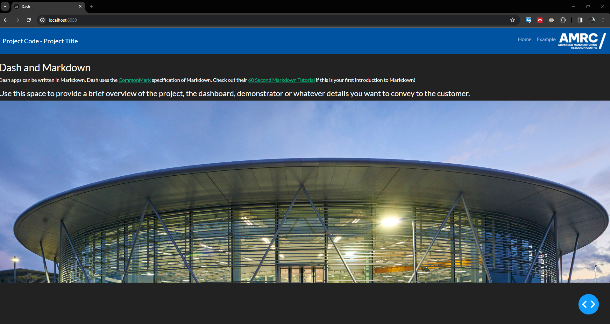
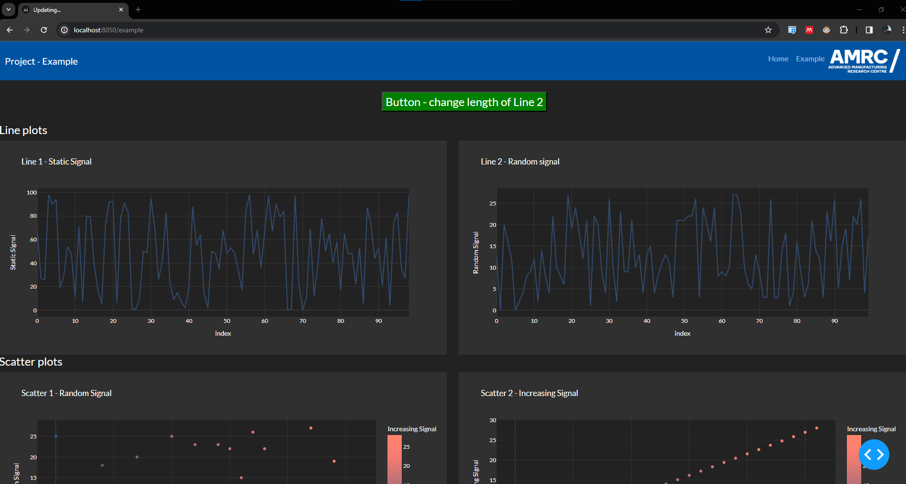

# Dashboarding

Dashboards (or web apps) can be a really powerful way to showcase the value of your project to the customer, when compared to a more traditional deliverable like a powerpoint presentation, particularly if it can be deployed in real-time alongside your physical demonstrator.

Popular frameworks for building dashboards include [Plotly Dash](https://dash.plotly.com/), [R Shiny](https://www.rstudio.com/products/shiny/) ([Shiny for Python](https://shiny.posit.co/py/docs/overview.html) is also now available), [Microsoft Power BI](https://www.microsoft.com/en-us/power-platform/products/power-bi) or [MATLAB Web App Server](https://uk.mathworks.com/products/matlab-web-app-server.html).

The project template is provided with a skeleton application for building interactive dashboards in Python with [Plotly Dash](https://dash.plotly.com/). The aim of this is to provide you with a solid foundation of boilerplate with a reasonable level of complexity/functionality to get your web app up and running quickly. With this, we are also able to provide a standardised structure and presentation with appropriate AMRC branding, reducing variability between projects and making the process easier for our researchers.

We strongly encourage feedback on the Python template and welcome collaboration on developing appropriate versions for frameworks in other languages, such as R or MATLAB.

## Running the dashboard with docker

The primary method for running the application is via the [`docker-compose.yml`](/docker-compose.yml) file. Ensure that the following section is not commented (i.e. there are no # before any of the lines highlighted below):

```
  dashboard:
    restart: unless-stopped
    build:
      context: ./code/dashboard
    ports:
        - "8050:8050"
    volumes:
      - ./code/dashboard:/app
      - ./data:/data
    env_file:
      - ./code/environment_variables/dashboard.env
```

and run in the terminal:

```
docker compose build
```

followed by:

```
docker compose up 
```

Also recall from the [Docker Guidance](/docs/Guidance/Docker.md) page that you can run it in the background with:

```
docker compose up -d
```

Note: once you've built the dashboard once (with `docker compose build`) you don't need to do this again. This is because the code workspace (on your PC) is mounted as a volume to the working directory of your docker container in the [docker-compose.yml](/docker-compose.yml) file. Re-running `docker compose up` (or making use of the hot-reload function of the [Dash Dev Tools](https://dash.plotly.com/devtools)).

## Accessing the dashboard in a web browser

The dashboard should now be accessible in the browser on [localhost:8050](http://localhost:8050/):



The first page to open is the main page, the content and layout of which is defined in [index.py](/code/dashboard/index.py). Two buttons on the Navbar (defined in [navbar.py](/code/dashboard/navbar.py)) are included by default (top right), linking to pages [Home](localhost:8050) and [Example](localhost:8050/example). Clicking on [Example](localhost:8050/example) takes you to another default page, with various example graphs and features to get you started:



The following sections will now go into more detail on the code used to generate these pages, and how you can adapt or build from them for your own application.

## Project organisation

The Python files for creating the dashboard are organised in the [dashboard directory](/code/dashboard/), as follows:

```
    ├── code      
    │   ├── dashboard               <- Utility for creating a Plotly dashboard.
    │   │   ├── assets              <- Directory for storing assets (images, logos, thumbnails).
    │   │   │   └── ...
    │   │   │   
    │   │   ├── pages               <- Directory for scripts which generate pages on the dashboard.
    │   │   │   ├── example.py      <- Example script to generate a new page.
    │   │   │   └── ...             <- Copy/rename the example script in here to create a new custom page.
    │   │   
    │   │   ├── __init.py__         <- Allows the code in the dashboard directory to be imported as a package.
    │   │   ├── app.py              <- Creates the Dash app, and controls the colour scheme.
    │   │   ├── Dockerfile          <- Script required to run the app in Docker.
    │   │   ├── index.py            <- Script to control the layout and contents of the front (index) page.
    │   │   ├── navbar.py           <- Script to control the contents of the navigation bar, at the top of the app.
    │   │   ├── requirements.txt    <- File to specify the packages required to be imported when running with docker.
    │   │   └── run.py              <- Script to control the host IP address, port number, debug mode and run the app.
    │   │
    │   ├── environment_variables   <- Directory for storing environment variables. 
    │   │   ├── dashboard.env       <- Store any dashboard specific environment variables which you need in here.
    │   │   └── ...
   ... ...
```

## Creating a custom dashboard for your project

The [example.py](/code/dashboard/pages/example.py) provides a core structure with some reasonably advanced Dash functionality, which you can use as a starting point to build your own custom dashboard. It will likely be worth experimenting with commenting out different components in the layout or callback functions and observing the changes, to gain an understanding of how it all fits together. Once you feel comfortable with the example features and have started customising your own dashboards, refer to the [Plotly documentation]((https://dash.plotly.com/)) to see what it is capable of (spoiler: a lot!).

### Setting the debug mode

Setting `Debug=True` in [`run.py`](/code/dashboard/run.py) will give you access to the [Dash Dev Tools](https://dash.plotly.com/devtools):

- **Callback Graph** - Dash displays a visual representation of your callbacks: which order they are fired in, how long they take, and what data is passed back and forth between the Dash app in the web browser and your Python code.
- **Code Reloading** - Dash restarts your app when you change code in your project.
- **Hot Reloading** - Dash automatically refreshes the web browser and your CSS files when you make a code change so that you don't need to manually refresh your browser.
- **In-App Error Reporting** - Dash reports error messages in the browser instead of your terminal so that you can stay focussed on your app and your code.
- **Component Validation** - Dash will display error messages if you pass malformed data to your components.
- **Better Error Messages** - Dash prunes certain stack traces from Flask & Dash internals and logs from Flask, Dash's underlying web server.
- **Serving Dev Bundles & Source Maps** - For component authors, you can serve a different JavaScript bundle during development.

Setting `Debug=False` will remove these features, but provide a cleaner/more stable experience for displaying the dashboard.

### The Example Page

The [example.py](/code/dashboard/pages/example.py) script controls what you see on the [Example](localhost:8050/example) page of the web app. Start by experimenting with this page to understand the components and what happens when you make changes in the code (you can always `Discard Changes` in your git source control if you break it and can't get it back to workging again). This should give you a good starting point for 

Comprehensive documentation on Dash callbacks can be found [here](https://dash.plotly.com/basic-callbacks) and [here](https://dash.plotly.com/advanced-callbacks).

The Script is organised into four sections:

#### Imports

The package imports required for building the page. If you need specific packages feel free to add them here.

#### Initialisation

Any functions or definitions which need to run when opening the page, to be reused throughout the rest of the script. In the default example, the [example_data.csv](/data/external/example_data.csv) file is read into a dataframe named `df_static` to use in one of the graphs, as well as initialsing the navbar with the relevant brand (i.e. the page title).

#### Layout

The code in this section defines the overall layout of the page, comprising the positions, sizes, initial configurations etc. of all the components which make up the page. These wwill typically be different types of graph, but can also include headings, text boxes, images, buttons, dropdowns or any other component you choose to specify. This template makes use of [Dash Bootstrap Components](https://dash-bootstrap-components.opensource.faculty.ai/), you can find a comprehensive list of the [available components here](https://dash-bootstrap-components.opensource.faculty.ai/docs/components/).

Although specifying the layout is quite intuitive once you get used to it, we would recommend making use of a code formater such as [Black](https://pypi.org/project/black/) to keep the code format in check as you add more components to the layout.

Comprehensive documentation on Dash layouts can be found [here](https://dash.plotly.com/layout).

#### Callbacks

Callback functions allow you to change properties in the components, by taking an `Input()` from one component and using that to trigger or influence and `Output()` in another. The [example.py](/code/dashboard/pages/example.py) script contains two example callbacks:

##### Callback 1

This function updates the figure titled 'Line 2 - Random Signal' with a new random signal once per second. Additionally, each click of the big green button at the top increases the number of points that are generated in the signal.

Takes 2 inputs:

```
Input("button-click", "n_clicks"),          <- Takes the property n_clicks from the component button-click
Input("interval-component", "n_intervals")  <- Takes the property n_intervals from the component interval-component
```

Runs the function and returns one output:

```
Output("line-2", "figure")                  <- Updates the figure property of component line-2
```

##### Callback 2

This function updates the two scatter plots once per second, both from the same function call with a single input. 'Scatter 1 - Random Signal' is randomly generated, and 'Scatter 2 - Increasing Signal' shows a signal which increases linearly for as long as the page runs. Colours on both charts are controlled by the value of the 'Increasing Signal' data.

Takes 1 input:

```
Input("interval-component", "n_intervals"), <- Takes the property n_intervals from the component interval-component
```

Runs the function and returns two outputs:

```
Output("scatter-1", "figure"),              <- Updates the figure property of component scatter-1         
Output("scatter-2", "figure"),              <- Updates the figure property of component scatter-2
```

### Adding data to the dashboard

In the [docker-compose.yml](/docker-compose.yml) file, we used [bind mounts](https://docs.docker.com/storage/bind-mounts/) to mount two directories from the host machine (your laptop) into the dashboard container. This means that any changes you make in these directories in your local working directory will be mirrored in the running docker container, allowing you to easily update the code or add data. Note that [volumes](https://docs.docker.com/storage/volumes/) are the preferred method for persisting data in Docker containers over bind mounts, but for the likely use cases of this template bind mounts are simpler and most likely sufficient (feedback requested!).

```
    volumes:
      - ./code/dashboard:/dashboard
      - ./data:/data
```

Mounting `./code/dashboard`  to `/dashboard` allows us to edit the code without needing to re-build the docker container after every change. `/dashboard` is the working directory in the container.

Mounting `./data` to `/data` allows us to access data stored in the [data](/data/) directory from within the container. In the [example.py](/code/dashboard/pages/example.py) script, an [example_data.csv](/data/external/example_data.csv) file is read and visualised in the *Line 1 - Static Signal*  graph.

The mounted directories are organised in the file system as follows:

    ├── dashboard      
    │   └── ...    
    ├── data    
    │   └── ...  
    ...

In order to access the data from within the dashboard script, prefix the file path with `../data/`, e.g.:

```
df = pd.read_csv('../data/external/example_data.csv')
```

### Adding a new page

Adding new pages to the dashboard is quite straightforward and (mostly) automated. 

The core mechanism involves adding a new script to the [pages directory](/code/dashboard/pages), with the same syntax as provided in [example.py](/code/dashboard/pages/example.py). A second, empty layout is provided in [example_2.py](/code/dashboard/pages/example_2.py) as an example of what you might start building from after copying.

Ensure you aren't duplicating any component names (see note below) and give your new script a sensible name. The name of the script will be the URL tagline that the page will be accessed at.

**Note - Dash reads the component names from all pages in the app, not just the page the user is currently on. As such each component name must be unique, so if you copy a page with already established components to build a new one ensure that you rename (or remove) the components on the new page.**

The code in [index.py](/code/dashboard/index.py) should now read the [pages directory](/code/dashboard/pages/) for all valid page layouts and generate them automatically (you'll have to save the script and restart the container of course, unless using hot-reloading with the debug mode). You can now build the new dashboard page as you see fit.

The one manual step required at this stage is to add the page to [navbar.py](/code/dashboard/navbar.py). In the following section of the `generate_navbar()` function, the `dbc.NavLink` button needs to be appended to the list `children`. 

```
    ### add new pages manually here with this syntax
    children.append(dbc.NavItem(dbc.NavLink("Example", href="/example")))
    # children.append(dbc.NavItem(dbc.NavLink("Example 2", href="/example_2"))) # uncomment this line to add the example_2 page to the navbar
```

In this example, you can un-comment the line `children.append(dbc.NavItem(dbc.NavLink("Example 2", href="/example_2")))` to make the page `example_2` accessible, by clicking on the text `Example 2` in the navbar. To add a new custom script, replicate this process on a new line with the name of your script and the text you want to appear on the navbar.

### AMRC branding - colour palettes

The script [app.py](/code/dashboard/app.py) defines a dict called `colors`, which contains the latest branding colours (as HEX codes) approved by the AMRC marketing team. You can access and use these anywhere in the dashboard with `colors[key]` where `key` is the name of the colour you want to use (e.g. `amrc-teal`). In this case, we would recommend keeping the primary colour palette for the main colours of the app (like the navbar) and making use of the secondary palette for greater impact in your graphs, where appropriate. The [example.py](/code/dashboard/pages/example.py) script demonstrates a few different options from the secondary colour palette used in the various graphs.

```
### AMRC branding overrides ###
colors = {
    # primary colour palette, use these for the most part
    "amrc-sky-blue": "#64CBE8",
    "amrc-teal": "#005A8F",
    "amrc-midnight-black": "#131E29",
    "amrc-midnight-black-5": "#EDEDF1",
    
    # secondary colour palette, can be use sparingly for additional impact + versatility
    "amrc-deep-violet": "#440099",
    "amrc-mint-green": "#00CE7C",
    "amrc-mauve": "#663DB3",
    "amrc-coral": "#E7004C",
    "amrc-aqua": "#00BBCC",
    "amrc-spearmint": "#3BD4AE",
    "amrc-purple": "#981F92",
    "amrc-flamingo": "#FF6371",
    "amrc-powder-blue": "#9ADBE8",
    "amrc-pastel-green": "#A1DED2",
    "amrc-lavender": "#DAA8E2",
    "amrc-peach": "#FF9664",
}
```
