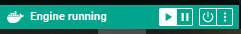

# Deploying an application with Docker

The guidance provided in this page is taken from the [Docker documentation](https://docs.docker.com/), and edited to match the utilities provided in this template. The guidance here is intended to get you set up and running with minimal effort and prior knowledge, so make sure to go through the documentation and other resources available online to improve your capabilities once you feel comfortable with the basics.

## Installing Docker

Firstly ensure you have a working installation for Docker on the device you wish to deploy your application. Installation instructions for Docker Desktop can be found [here](https://docs.docker.com/desktop/) for [Mac](https://docs.docker.com/desktop/install/mac-install/), [Windows](https://docs.docker.com/desktop/install/windows-install/), or [Linux](https://docs.docker.com/desktop/install/linux-install/).

## Docker Compose

This project template contains example docker files to get you quickly up and running with a containerised application. In this implementation we are using the [Docker Compose](https://docs.docker.com/compose/) tool for defining and running multi-container applications. It is the key to unlocking a streamlined and efficient development and deployment experience. The Docker Desktop installation in the previous step 

Compose simplifies the control of your entire application stack, making it easy to manage services, networks, and volumes in a single, comprehensible YAML configuration file. Then, with a single command, you create and start all the services from your configuration file.

Compose works in all environments; production, staging, development, testing, as well as CI workflows. It also has commands for managing the whole lifecycle of your application:

- Start, stop, and rebuild services
- View the status of running services
- Stream the log output of running services
- Run a one-off command on a service

### Key benefits

Using Docker Compose offers several benefits that streamline the development, deployment, and management of containerized applications:

- Simplified control: Docker Compose allows you to define and manage multi-container applications in a single YAML file. This simplifies the complex task of orchestrating and coordinating various services, making it easier to manage and replicate your application environment.
- Efficient collaboration: Docker Compose configuration files are easy to share, facilitating collaboration among developers, operations teams, and other stakeholders. This collaborative approach leads to smoother workflows, faster issue resolution, and increased overall efficiency.
- Rapid application development: Compose caches the configuration used to create a container. When you restart a service that has not changed, Compose re-uses the existing containers. Re-using containers means that you can make changes to your environment very quickly.
- Portability across environments: Compose supports variables in the Compose file. You can use these variables to customize your composition for different environments, or different users.
- Extensive community and support: Docker Compose benefits from a vibrant and active community, which means abundant resources, tutorials, and support. This community-driven ecosystem contributes to the continuous improvement of Docker Compose and helps users troubleshoot issues effectively.

### Docker compose for development

When you're developing software, the ability to run an application in an isolated environment and interact with it is crucial. The Compose command line tool can be used to create the environment and interact with it.

The [Compose file](/docker-compose.yml) (also see [documentation overview here](https://docs.docker.com/compose/compose-file/)) provides a way to document and configure all of the application's service dependencies (databases, queues, caches, web service APIs, etc). Using the Compose command line tool you can create and start one or more containers for each dependency with a single command (docker compose up).

Together, these features provide a convenient way for you to get started on a project. Compose can reduce a multi-page "developer getting started guide" to a single machine-readable Compose file and a few commands.

## Using the template utilities

The template currently includes three core services that you can deploy out-of-the-box. You are welcome to utilise or modify the services within your project as you see fit, or add new services where you see the need or opportunity. We strongly encourage you to share any useful services for data science that might benefit others, use either the [Issues](https://amrcgithub.shef.ac.uk/IMG/datascience-project-template/issues) or [Discussions](https://amrcgithub.shef.ac.uk/IMG/datascience-project-template/discussions/landing) tabs on the github page to share your findings and we can add to the library of core services included in the template going forward.

### Editing/selecting the services

The Docker Compose file is a relatively simple [YAML](https://en.wikipedia.org/wiki/YAML) file which allows you to build and run a complex multi-container network of services with just two lines of code.

The pre-configured services in the template are detailed below. You can comment out (`CTRL + K + C` by default in VS Code) or delete the services you do not need/want to run.

#### dashboard

A  generic, managed template for building dashboards with [Plotly Dash](https://dash.plotly.com/). Running this service will create an empty webapp in the style of the the [amrcdatascience](http://amrcdatascience.shef.ac.uk:8050/) internal webapp, with AMRC branding and a standardised approach for adding pages + graphs. Edit or add scripts to the [dashboard directory](/code/dashboard/) to customise for your project. By default, the container will run the [`run.py`](/code/dashboard/run.py) script. Environment variables are stored and can be configured [here](/code/environment_variables/dashboard.env).

```
# ## dashboard - visualisation app with plotly dashboard
  dashboard:
    restart: unless-stopped
    build:
      context: ./code/dashboard
    # network_mode: "host"
    # expose port 8050 to access the dashboard on localhost:8050
    ports:
        - "8050:8050"
    volumes:
      # bind mount the 'dashboard' working directory to update scripts without needing to re-run docker compose build
      - type: bind
        source: ./code/dashboard
        target: /dashboard
      # bind mount the data directory to read + write to stored data on the host (your PC) 
      - type: bind
        source: ./data
        target: /data
    # add the environment variable file to the container
    env_file:
      - ./code/environment_variables/dashboard.env
```

#### python-app

A template for deploying your main python application. Edit or add to the [code directory](/code/) to customise to your project. By default, the container will run the [`main.py`](/code/main.py) script. Environment variables are stored and can be configured [here](/code/environment_variables/python-app.env).

```
# # python-app - python script for data science application
  python-app:
    restart: unless-stopped
    build: 
      context: ./code
    # network_mode: "host"
    volumes:
      # bind mount the 'code' working directory to update scripts without needing to re-run docker compose build
      - type: bind
        source: ./code
        target: /python-app
      # bind mount the logs directory to monitor operation + debug
      - type: bind
        source: ./code/logs
        target: /python-app/logs
      # bind mount the data directory to read + write to stored data on the host (your PC) 
      - type: bind            
        source: ./data
        target: /data
      ## if you'd prefer to use a docker volume to manage data, you can use this syntax to mount it in place of the bind mount
      # - type: volume        
      #   source: data
      #   target: /var/data
    # add the environment variable file to the container
    env_file:
      - ./code/environment_variables/python-app.env
```

#### influxdb

A template for deplying a local instance of [InfluxDB](https://www.influxdata.com/products/influxdb/), a time-series historian database. Environment variables are stored and can be configured [here](/code/environment_variables/influxv2.env).

```
## InfluxDB - Time-series historian service
  influxdb:
    image: influxdb:latest
    restart: unless-stopped
    # network_mode: "host"
    # expose port 8086 to access the influxdb dashboard on localhost:8086
    ports:
      - "8086:8086"
    volumes:
      # mount the influxdb-storage volume to persist data in the container 
      - type: volume
        source: influxdb-storage
        target: /var/lib/influxdb2
      # mount the influxdb-config volume to persist configurations in the container 
      - type: volume
        source: influxdb-config
        target: /etc/influxdb2
    # add the environment variable file to the container
    env_file:
      - ./code/environment_variables/influxv2.env
```

#### Running the services

Ensure that the docker engine is running. On Linux, the docker engine should be running by default providing you have it installed. On Windows, you need to open the Docker desktop application and check the box/symbol in the bottom left corner is green, as below:



To run the selected services, open a command line/terminal and navigate to the project directory with:

```
cd [path to your project]
```

If you're using VS Code, you can open the [workspace](/datascience-project-template.code-workspace) (double clicking this from the File explorer will open a VS code window) and the in-built terminal will default to the project directory.

Check: running the following command lists all files in the current working directory:

```
ls
```

This should return a list of all the files/folders in the root directory, one of which should be `docker-compose.yml`. If it's different, then you're in the wrong directory!

The first thing to do is build the containers. The following command takes the configuration defined in the `docker-compose.yml` file and turns it into services that can be run:

```
docker compose build
```

Once built, the containers can be tested by executing:

```
docker compose up
```

This will run the container in the current terminal, printing any logs/outputs which you can monitor for development and debugging. You will not be able to execute any more commands in the terminal (unless the services stop themselves, either through an error or reaching the end of the script), but can exit with the shortcut `CTRL + C`.

To run the container in the background (in detached mode) and free up your terminal, run:

```
docker compose up -d
```

In detached mode, the services will continue to run unless a) they fail due to an error, b) they are manually stopped or c) the system they are running on powers down (in detached mode, they should restart though when it powers back up, providing the docker engine is running).

To manually stop the services, run (still in the project directory):

```
docker compose down
```

Congratulations, you (hopefully) have just deployed your first app with Docker! There is a substantial degree of complex functionality and control that you can get into, but the core content provided here should be enough to extract real benefits easily for most use cases.

*Page created by TR - Mar 24*