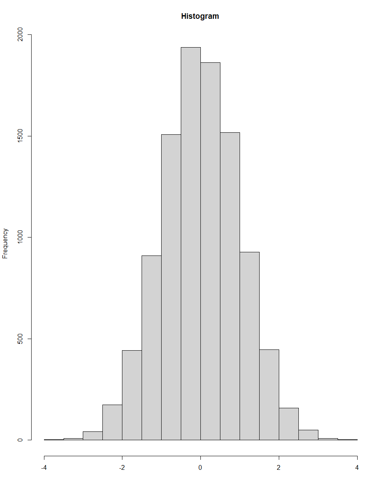
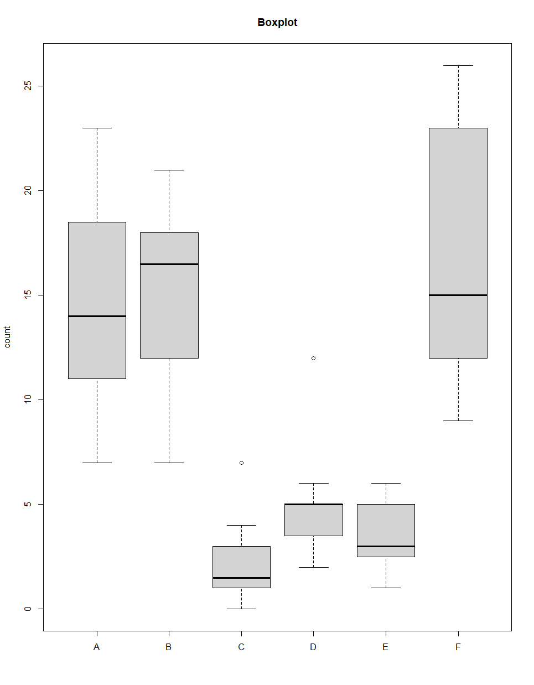
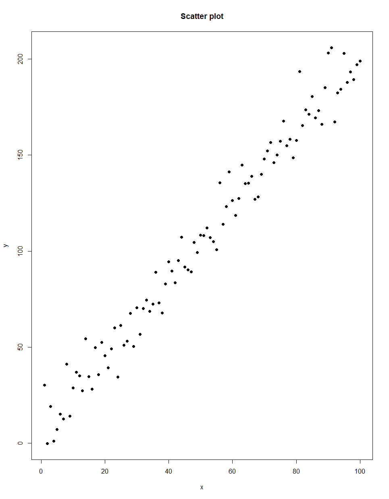
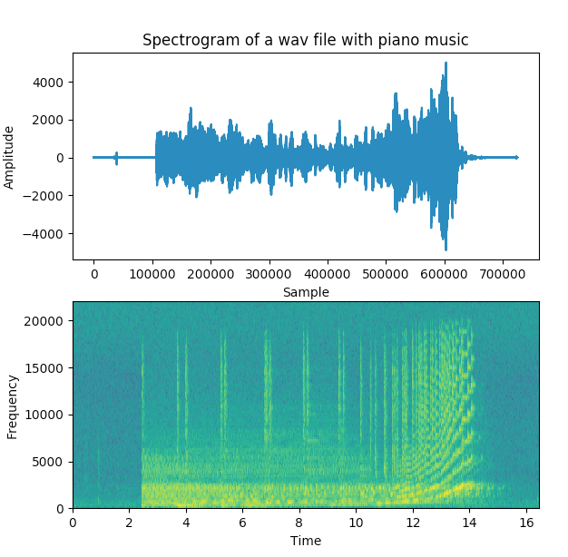

# Some common plots for Exploratory Data Analysis

## Histograms

Histograms are used for continuous data and are good ways to show the shape of the data. The shape of the data can 
be a good way of determining which of the summary statistics are reliable and robust and which models are appropriate 
for further analysis. For example, when the data has a central tendency and is roughly symmetric (the bell-shape) then 
the mean and standard deviation are suitable measures of the centre and the spread but when the shape has some 
skew then it is more suitable to use the median as a central measure and measures of the spread should be given by 
some relevant quantiles (for example, the 5th and 95th quantiles will give you an interval in which the 90% of the data 
lies).

## Box plots 

Boxplots are an easy way to visualise key summary statistics for grouped data and easily allows comparison of different 
groups. The precise statistics used to create boxplots can differ between software but typically the centre of the box is 
the median (i.e. 50% of the data is one side, and 50% the other), the box encompasses the interquartile range (IQR, the 
central 50% of the data) and the whiskers will be some measure to represent an interval covering 95% of the data. Outliers may be shown by dots and may indicate some further investigation is necessary (or not, the box and whiskers 
are created such that ~5% of the data is likely to be outlying).

## Scatter plots

Scatter plots are a useful exploratory tool when pairwise relationships are expected. Typically, they would be used for 
continuous data but there can be value in exploring discrete variables with a scatter plot too. Typically, scatter plots will 
look like a random scatter of points for independent variables and any structure indicates some relationship between 
two variables (either a response and explanatory or multiple explanatory variables). Any structure found in scatter plots 
should be considered as part of the modelling process. Any clear relationships that can be considered explanatory and 
response would help to define a regression model whist any relationships between explanatory variables will need to be taken care of before modelling since most models assume independent explanatory variables. Simple ways to take 
care of co-dependencies are to use only one of the related variables, to find some unique way of reducing them to a 
single dimension or to use models where correlation between explanatory variables can be built in. A scatter plot can 
also provide a good visualisation of the data design. 

## Time series plots

When the data is known to be a time-series the most effective way to visualise it is using a time-series plot. In a time-series plot it is possible to identify trends over time or cyclic behaviour. A perhaps more useful plot would be the 
decomposition of a time-series where the trend, seasonality and error are calculated then plotted separately. Obviously, 
this makes it easy to determine the trend and seasonality behaviours but any additional structure in the errors can be 
indicative of departures from the norm. When time-series modelling is required, how regular seasonality patterns are 
but more importantly shows how long correlation persists over time. For many models or statistical measures independence between points is required, this can be achieved by thinning the data to remove the persistent 
correlations.

## Spectrograms

For many manufacturing applications, particularly those involving dynamics/vibration signals, the power spectrum of a 
time-series can reveal interesting features more readily than a time-series analysis. Commonly, the time-domain data 
is converted to a power spectrum (the frequency-domain) with an FFT, which indicates the relative magnitudes of the 
frequency components which make up the signal. Engineering knowledge can then be used to analyse the signal, 
investigating characteristics such as the amplitude and locations of natural frequencies, harmonics and banding across 
the spectrum, to reveal information such as a faulty bearing on a machine tool axis. The FFT itself provides the power spectrum as a snapshot in time, numerous concurrent calculations can be stitched together to indicate how the power 
spectrum changes temporally, in a plot known as a Spectrogram. The Spectrogram plots time vs frequency on the X & Y 
axes, respectively, with a third dimensions (usually colour on a 2D plot) describing the power spectrum amplitude at 
any given time/frequency combination. Such plots can be very useful for visualizing for example, how the vibration 
signal changes before/during/after a machining operation, to identify unusual patterns which may be indicative of 
excessive cutting tool wear.

 *Page created by LL - Mar 2024*