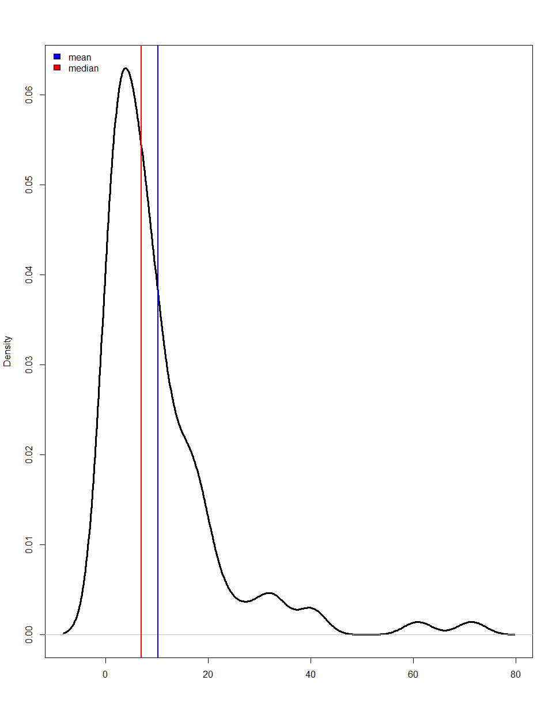
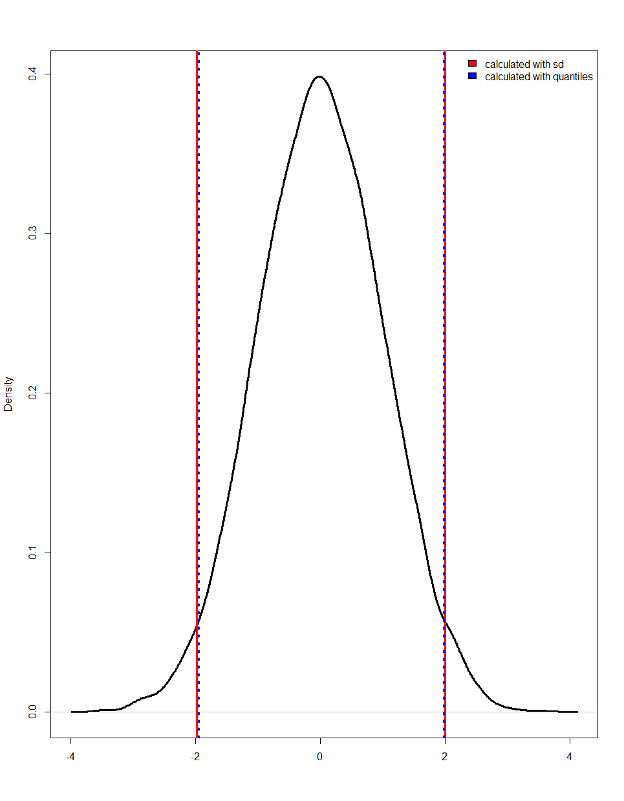
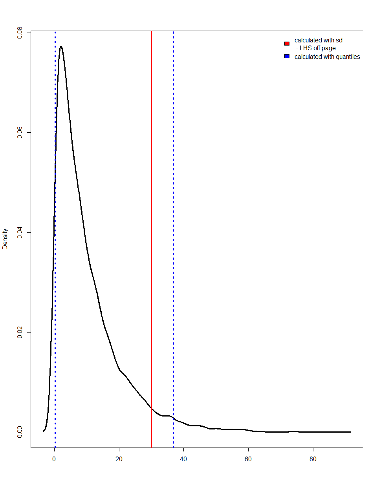

# An overview of statistical summaries and what they mean. 

Statistical summaries are useful for providing a quick snapshot of key characteristics and features in the available data. 
At the simplest level, this will usually involve the calculation of statistical features to describe the data, such as 
the measures of the centre (mean, median and mode) and standard deviation/variance, the overall distribution 
of the data, or the existence of outliers. In a manufacturing application, these might be employed to understand 
the normal operating ranges for a given feature, such as the temperature profile of a cutting process, or to 
describe the quality control compliance for a batch of manufactured parts. 

## The central value

**The mean and the median**
The central value of a data stream is usually measured by the mean or the median. The mean is the arithmetic average and the median is the centre of the range such that 50% of the values fall below and 50% of the values above. For a symmetric distribution the mean and the median will be close to each so comparing them will give an idea of the shape of the distribution. When the mean and median are not close it is recommended to report both. 

The following images show the mean and median for a symmetric distribution and a skewed distribution.

## The spread

**The standard deviation**
The spread of a data stream is usually calculated using the standard deviation but this is usually assumed to show spread symmetric around the mean, as in the Gaussian distribution. If the data can be approximated using the Guassian distribution then approximately 68% of the data lies 1 standard deviation either side of the mean and approximately 95% of the data lies betweens 2 standard deviations either side of the mean.  If the data is skewed then the standard deviation is not recommended to measure spread in the data as the above does not apply. 

**The range and quantiles**
Another option is to report the minimum and maximum and some quantiles of the data distribution. Quantiles mark various points in the data where a given percentage of data is below the reported value, for example the 5th percentile gives the value below which 5% of the data lie. Two common intervals given by the quantiles are the InterQuartile Range (IQR) marked by the 25th and 75th percentile and therefore giving the values between which the middle 50% of the data lie and the range given by the 2.5th percentile and the 97.5th percentile giving the values between which 95% of the data lie. 

The following images show approximate 95% intervals for a symmetric distribution and a skewed distribution calculated using the standard deviation and the quantiles. It can be seen that using the standard deviation for a skewed distribution does not give a correct sense of where 95% of the data lie. 

## Calculating the summary statistics

Open-source packages such as pandas profiling in Python – utilised in Databricks’ AutoML EDA notebook - allow for automated summarisation of key statistics and characteristics. The summary() command in R also provides some key statistical values.