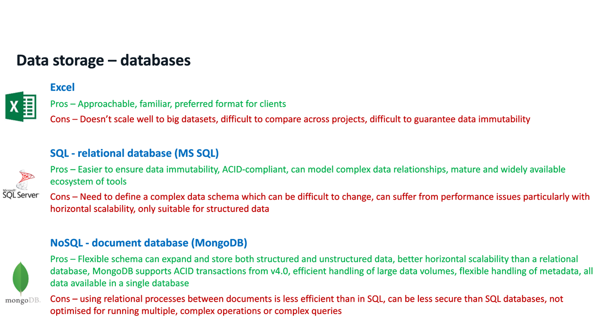
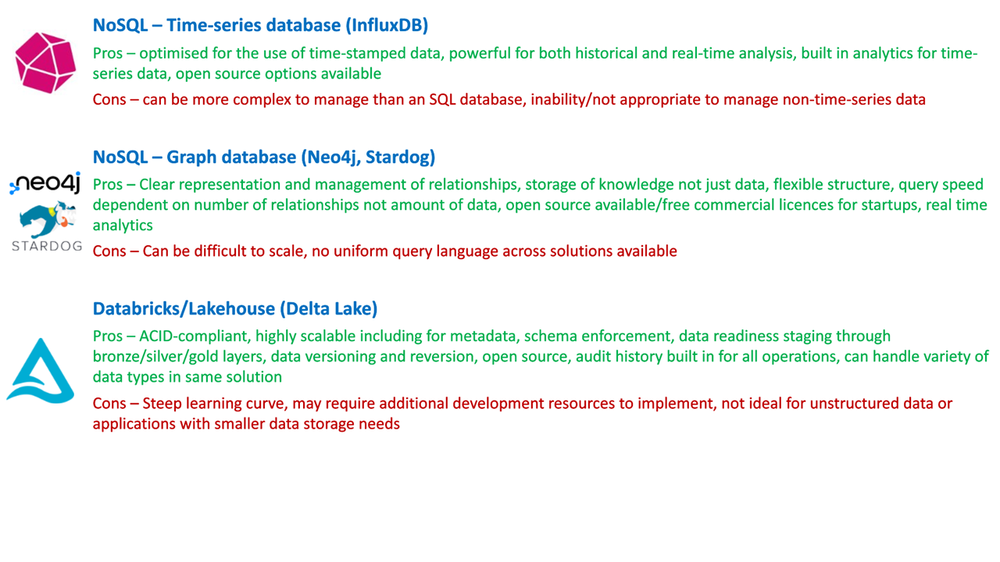

# Storage options - formats

There are a number of different formats in which the data can be stored, listed below. The choice of storage format will depend on a few factors including the tools that will be used to process the data, the analysis tools, the required access and access efficiency.  

 *Page created by LL - Mar 2024, image created by TR - Feb 2024*